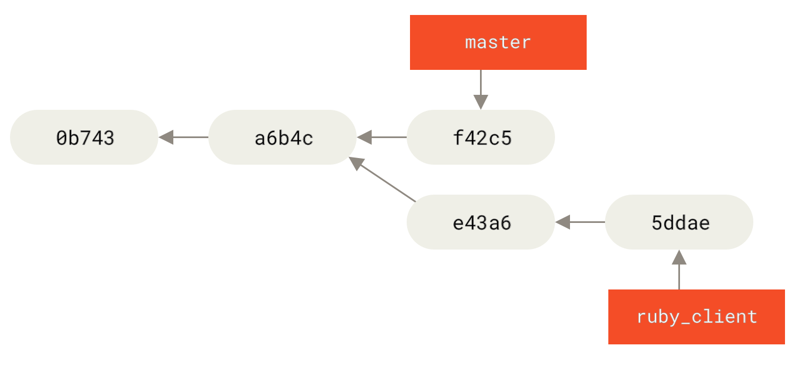

# 管理提交历史：Rebase, Reset, Revert, Cherry-pick, Reflog

Git 提供了强大的工具来修改和管理提交历史。理解这些工具的原理和适用场景对于维护清晰、整洁的项目历史至关重要。

**⚠️ 警告：** 其中一些命令（特别是 `git rebase` 和 `git reset`）会**重写提交历史**。在对**已推送到共享仓库的分支**使用这些命令时，必须**极其谨慎**，否则会给协作者带来严重问题。请务必理解其原理和潜在风险。

## 变基 (Rebase): 线性化提交历史

`git rebase` 是整合来自不同分支的更改的两种主要方法之一（另一种是 `git merge`）。

*   **`merge`**: 将两个分支的历史连接在一起，并创建一个新的**合并提交 (Merge Commit)**。如果分支有分叉，历史记录会呈现非线性。
*   **`rebase`**: 获取当前分支（例如 `feature`）上独有的提交，将它们暂存，然后将当前分支指向目标基底分支（例如 `main`）的最新提交，最后**逐一重新应用**之前暂存的提交。结果是 `feature` 分支看起来像是直接从 `main` 的最新状态开发出来的，历史记录保持**线性**。


*rebase 与 merge 的区别：rebase 创建线性历史，而 merge 保留完整历史记录和分支结构*

**核心场景:**

1.  **保持特性分支与主线同步**: 在开发特性分支时，主线 (`main`) 可能已经更新。在合并回 `main` 之前，先将特性分支变基到 `main` 的最新提交上：
    ```bash
    git switch feature/my-feature
    git fetch origin # 获取远程更新
    git rebase origin/main # 将 feature/my-feature 变基到最新的 origin/main 之上
    # (解决变基过程中可能出现的冲突)
    ```
    这样做可以使后续合并回 `main` 时通常能进行**快进合并 (Fast-forward)**，保持主线历史整洁。
2.  **清理本地提交历史**: 在将本地的一系列零散提交（"fix typo", "wip" 等）推送到共享仓库前，使用**交互式变基 (`git rebase -i`)** 将它们合并 (squash/fixup)、编辑 (reword/edit) 或重新排序 (reorder)，形成更清晰、更有意义的提交记录。

**操作示例 (将 `feature` 变基到 `main`):**

初始状态:
```
      A---B---C feature
     /
D---E---F---G main
```

执行:
```bash
git switch feature
git rebase main
```

结果:
```
              A'--B'--C' feature
             /
D---E---F---G main
```
注意：`A`, `B`, `C` 的内容被重新应用，生成了**新的提交** `A'`, `B'`, `C'`，它们的**提交哈希值 (SHA-1) 会改变**。

> **Rebase 黄金法则:**
> **永远不要对已经推送到公共/共享仓库并且可能被他人使用的分支执行 `rebase` 操作！**
> 因为 `rebase` 通过创建新提交来重写历史。如果其他人已经基于旧的提交进行了开发，你的变基会使他们的本地仓库与远程仓库产生严重分歧，合并时会非常混乱。**变基主要用于清理你自己的、尚未分享的本地提交历史。**

**实用技巧:** `git pull --rebase`
这相当于 `git fetch` 后跟 `git rebase`。它会先获取远程更新，然后将你本地尚未推送的提交变基到更新后的远程分支之上，避免了 `git pull` (默认是 merge) 可能产生的合并提交。

## 交互式变基 (`git rebase -i`): 精雕细琢提交历史

交互式变基是 `rebase` 的一个强大模式，允许你在变基过程中对一系列提交进行精细控制。

**操作:** `git rebase -i <base-commit>`
`<base-commit>` 是你想要修改的提交范围的**父提交**。例如，修改最近 3 个提交：`git rebase -i HEAD~3`。

执行后，Git 会打开一个编辑器，列出从 `<base-commit>` 之后到当前 `HEAD` 的所有提交，每行一个，格式类似：
```
pick a1b2c3d Commit message 1
pick e4f5g6h Commit message 2
pick i7j8k9l Commit message 3

# Rebase ... onto ...
#
# Commands:
# p, pick <commit> = use commit
# r, reword <commit> = use commit, but edit the commit message
# e, edit <commit> = use commit, but stop for amending
# s, squash <commit> = use commit, but meld into previous commit
# f, fixup <commit> = like "squash", but discard this commit's log message
# x, exec <command> = run command (the rest of the line) using shell
# b, break = stop here (continue rebase later with 'git rebase --continue')
# d, drop <commit> = remove commit
# l, label <label> = label current HEAD with a name
# t, reset <label> = reset HEAD to a label
# m, merge [-C <commit> | -c <commit>] <label> [# <oneline>]
# ...
```

你可以修改每行前面的命令 (`pick` 改为 `squash`, `reword`, `edit`, `drop` 等)，或者调整行的顺序来重新排序提交。保存并关闭编辑器后，Git 会按照你的指示执行操作。

**常用命令:**
*   **`pick` (p)**: 保留该提交不变。
*   **`reword` (r)**: 保留该提交，但暂停让你修改提交信息。
*   **`edit` (e)**: 保留该提交，但暂停让你修改提交内容（例如添加文件、修改代码），修改后 `git commit --amend`，然后 `git rebase --continue`。
*   **`squash` (s)**: 将该提交**合并**到**前一个**提交中。Git 会暂停让你编辑合并后的提交信息（默认包含两个提交的信息）。
*   **`fixup` (f)**: 类似 `squash`，但**丢弃**该提交的提交信息，直接使用前一个提交的信息。常用于合并小的修复提交。
*   **`drop` (d)**: 完全**移除**该提交。
*   **重新排序**: 直接在编辑器中调整行的顺序。

**场景:** 在推送前清理本地分支，将多个小的、临时的提交合并成逻辑单元，修改不清晰的提交信息，移除调试代码等。

## 重置 (Reset): 回溯提交历史 (需谨慎！)

`git reset` 是一个强大的命令，用于将当前分支的 `HEAD` 指针移动到指定的历史提交。根据不同的模式，它还会影响**暂存区 (Index)** 和**工作目录 (Working Directory)**。

**⚠️ 警告：** `git reset` 会修改当前分支的历史。**绝对不要**对已推送到公共仓库的分支使用 `reset` 来移除提交，这会破坏协作者的仓库历史。它主要用于修改**本地**的历史记录。

**三种主要模式:**

*   **`git reset --soft <commit>`:**
    *   **移动 `HEAD` 指针**到 `<commit>`。
    *   **暂存区** 和 **工作目录** 保持不变。
    *   效果：`<commit>` 之后的所有提交内容都变成**已暂存 (staged)** 状态。
    *   **场景:** 合并本地多个零散提交。例如，`git reset --soft HEAD~3` 将最近 3 个提交的内容放入暂存区，然后 `git commit -m "合并成一个有意义的提交"`。

*   **`git reset --mixed <commit>` (默认模式):**
    *   **移动 `HEAD` 指针**到 `<commit>`。
    *   **重置暂存区**以匹配 `<commit>` 的状态。
    *   **工作目录** 保持不变。
    *   效果：`<commit>` 之后的所有提交内容都变成**未暂存 (unstaged)** 的更改。
    *   **场景:** 撤销错误的 `git add`。例如，`git add .` 后发现加错了文件，`git reset HEAD <file>` 将文件移出暂存区；`git reset` (不带 commit) 撤销所有暂存。撤销最近一次提交并将更改放回工作目录：`git reset HEAD~1`。

*   **`git reset --hard <commit>`:**
    *   **移动 `HEAD` 指针**到 `<commit>`。
    *   **重置暂存区**以匹配 `<commit>`。
    *   **重置工作目录**以匹配 `<commit>`。
    *   效果：**彻底丢弃** `<commit>` 之后的所有提交，以及工作目录和暂存区中**所有未提交的更改**。
    *   **⚠️ 极度危险！** 丢失的更改很难恢复（除非用 `reflog`）。
    *   **场景:** 彻底放弃某个提交之后的所有工作和本地修改，回到一个已知的干净状态。例如，`git reset --hard origin/main` 使本地分支与远程完全一致（会丢失本地未推送的提交和未提交的更改）。


*Git reset 的三种模式：--soft 只移动 HEAD，--mixed 重置暂存区，--hard 同时重置工作目录*

## 撤销 (Revert): 安全地“撤销”提交

与 `reset` 修改历史不同，`git revert <commit>` 通过创建一个**新的提交**来撤销指定 `<commit>` 所引入的更改。原始的错误提交仍然保留在历史中，但其效果被新提交抵消了。

**关键点:**
*   `revert` **不会**重写历史，而是**追加**历史。
*   它是**安全**的操作，可以用于撤销**已推送到共享分支**上的错误提交。

**场景:**
发现 `main` 分支上的某个已发布的提交 (`a1b2c3d`) 引入了一个 Bug。
```bash
git switch main
git revert a1b2c3d
# Git 会打开编辑器让你确认撤销提交的信息
# 保存并关闭编辑器，生成一个新的撤销提交
git push origin main # 推送这个新的撤销提交
```

**`reset` vs `revert` 总结:**
*   **修改本地私有历史**: 使用 `reset` (通常 `--soft` 或 `--mixed`) 或 `rebase -i`。
*   **撤销公共共享历史**: 使用 `revert`。

## 拣选 (Cherry-pick): 精准复制代码提交

`git cherry-pick <commit-hash>` 允许你选择一个或多个来自**其他分支**的提交，并将这些提交引入的**代码变更**应用到你**当前所在**的分支。它会创建一个**新的提交**，包含被拣选提交的变更内容。



*cherry-pick 操作允许你选择指定的提交，并将其应用到当前分支*

**核心场景:**

1.  **紧急修复 (Hotfix):** 在 `develop` 分支修复了一个线上 Bug (提交 B)，需要立即将这个修复应用到 `main` 分支，但不希望引入 `develop` 上的其他未完成特性。
    ```bash
    git switch main
    git cherry-pick <commit-hash-B>
    git push origin main
    ```
2.  **功能回传 (Backporting):** 将某个在新版本分支 (`v2.0`) 中开发的小功能或优化 (提交 C)，选择性地应用到旧的、仍在维护的版本分支 (`v1.1`) 上。
    ```bash
    git switch v1.1
    git cherry-pick <commit-hash-C>
    ```

**注意事项:**
*   `cherry-pick` 复制的是**变更内容**，不是提交本身，因此会在当前分支创建**新的提交**，具有不同的哈希值。
*   如果被拣选的提交依赖于其父提交的更改，直接拣选可能会失败或引入错误。
*   过度使用 `cherry-pick` 可能意味着分支策略混乱。优先考虑 `merge` 或 `rebase`。

## 引用日志 (Reflog): Git 的时光机与安全网

Git 在本地记录了你的 `HEAD` 和分支指针在过去一段时间内的移动轨迹。`git reflog` 命令可以查看这份日志，即使某些提交因为 `reset` 或 `rebase` 而从正常的分支历史中“消失”了。

**核心场景 (本地恢复):**

1.  **恢复误删的分支:** 不小心 `git branch -D my-feature`。
    ```bash
    git reflog # 找到删除前 my-feature 指向的提交哈希 (e.g., e4f5g6h)
    git checkout -b my-feature e4f5g6h # 从该哈希恢复分支
    ```
2.  **撤销灾难性的 `reset --hard`:** `git reset --hard HEAD~3` 后发现删多了。
    ```bash
    git reflog # 找到 reset 操作之前的 HEAD 位置 (e.g., HEAD@{1}) 对应的哈希 (e.g., a1b2c3d)
    git reset --hard a1b2c3d # 回到之前的状态
    ```

**操作:**
```bash
git reflog
```
输出类似：
```
a1b2c3d HEAD@{0}: reset: moving to a1b2c3d
e4f5g6h HEAD@{1}: reset: moving to HEAD~3
i7j8k9l HEAD@{2}: commit: Add final touches
...
```
`reflog` 是你本地仓库的最后一道防线，用于从**本地操作失误**中恢复。它记录的是**本地指针**的移动，默认只保留一段时间（通常 90 天）。


*Git reflog 记录了 HEAD 和分支指针的移动历史，可以用来恢复意外删除的提交*