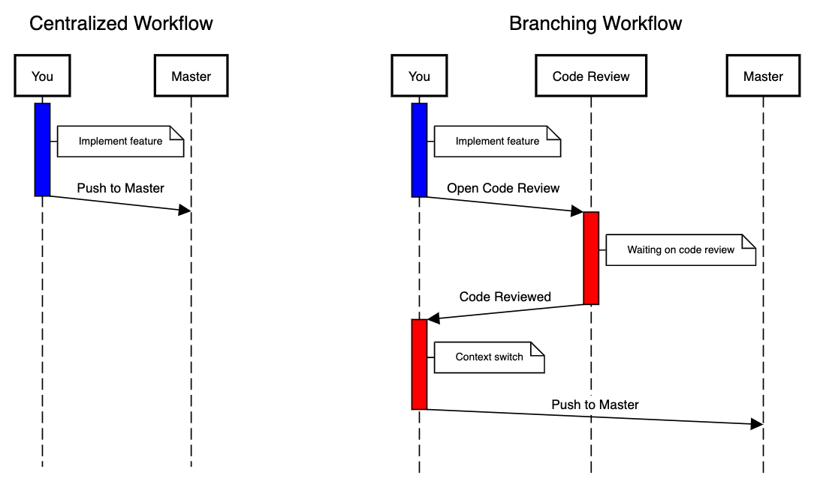
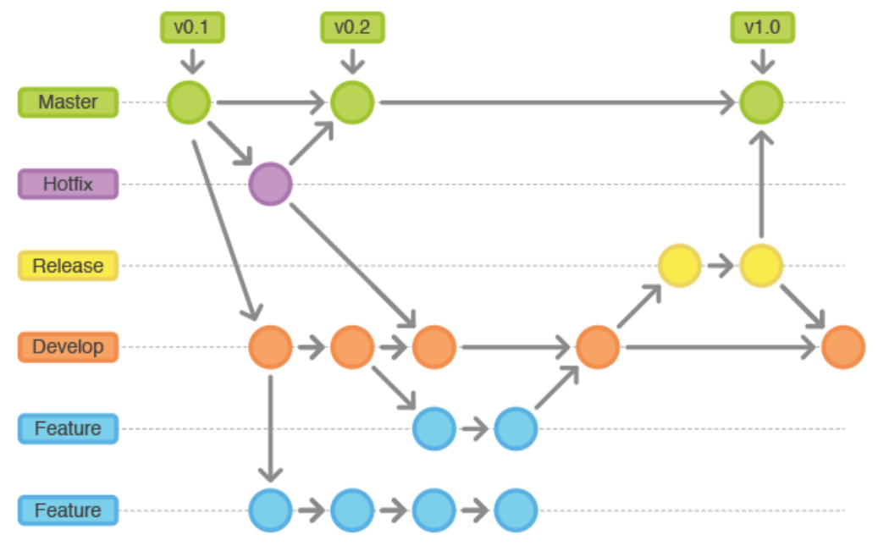

# Git 团队协作流程：模式与实践

当多个人共同参与一个项目时，仅仅知道 Git 命令是不够的。建立一套清晰、一致的**协作流程 (Workflow)** 至关重要。它能确保：

*   **代码集成顺畅**: 减少合并冲突，更容易将不同成员的工作整合在一起。
*   **主分支稳定**: 保护核心分支（如 `main`）不被未测试或未完成的代码污染。
*   **代码质量可控**: 通过代码审查（Code Review）提升代码质量。
*   **开发过程可追溯**: 清晰地了解每个功能或修复的开发历史。

Git 本身非常灵活，支持多种协作模式。以下介绍几种常见的流程，各有优缺点和适用场景。

## 1. 集中式工作流 (Centralized Workflow)

这种模式模拟了像 Subversion (SVN) 这样的传统集中式版本控制系统。所有团队成员都克隆同一个中央仓库 (`origin`)，并在同一个主分支 (`main`) 上工作。

**流程:**
1.  `git clone <中央仓库URL>`
2.  本地修改代码
3.  `git add .` -> `git commit -m "..."`
4.  **推送前先拉取**: `git pull origin main` (获取远程 `main` 的最新提交并合并到本地 `main`)
5.  解决可能出现的合并冲突
6.  `git push origin main` (将本地提交推送到远程 `main`)



*集中式工作流：所有开发者直接在 main 分支上工作并推送到中央仓库*

**优点**:
*   简单直观，容易上手，尤其适合从 SVN 过渡的团队。
*   对于非常小的团队或个人项目可能足够。

**缺点**:
*   **极易产生冲突**: 多人同时修改并推送 `main` 分支，冲突会非常频繁。
*   **`main` 分支不稳定**: 任何人的提交都直接进入 `main`，可能包含未完成或有问题的代码，难以保证 `main` 随时可发布。
*   **不利于代码审查**: 没有明确的代码审查环节。
*   **不推荐用于大多数团队项目。**

## 2. 功能分支工作流 (Feature Branch Workflow)

这是目前**最流行、最被广泛推荐**的协作模式之一。核心思想是：**任何新工作（新功能、Bug 修复、实验等）都在其专属的分支上进行，完成后再合并回主开发线。**

**关键原则**:
*   `main` 分支（或 `develop` 分支）始终代表稳定、可部署（或接近可部署）的状态。
*   所有开发工作都在短期的**功能分支 (Feature Branches)** 上完成。分支名应清晰描述其目的（如 `feature/user-login`, `bugfix/css-layout-issue`）。
*   通过**合并请求 (Pull Request / Merge Request)** 进行代码审查和讨论，然后再合并。

**流程:**
1.  **从主线创建分支**:
    ```bash
    # 确保本地主线是最新状态
    git switch main
    git pull origin main
    # 创建并切换到新的功能分支
    git switch -c feature/awesome-new-feature
    ```
2.  **在分支上开发**: 进行编码、修改、测试，并频繁提交。
    ```bash
    # ... work, work, work ...
    git add .
    git commit -m "实现 awesome 功能的第一部分"
    # ... more work ...
    git commit -m "完成 awesome 功能并添加测试"
    ```
3.  **(可选但推荐) 定期同步主线更新**: 为了减少最终合并时的冲突，可以定期将 `main` 分支的最新更改合并到你的功能分支：
    ```bash
    # 切换回 main 并拉取最新代码
    git switch main
    git pull origin main
    # 切换回功能分支
    git switch feature/awesome-new-feature
    # 将最新的 main 合并到当前功能分支
    git merge main
    # (解决可能出现的冲突并提交)
    ```
4.  **推送功能分支**: 将本地的功能分支推送到远程仓库 (`origin`)，以便备份、协作或发起合并请求。
    ```bash
    # 首次推送需要 -u 设置上游跟踪
    git push -u origin feature/awesome-new-feature
    ```
5.  **创建合并请求 (Pull Request / Merge Request)**: 当功能开发完成并在分支上测试通过后，通过 GitHub/GitLab 等平台界面，从你的 `feature/awesome-new-feature` 分支向 `main` 分支发起一个合并请求。
6.  **代码审查与讨论**: 团队成员（或其他指定审查者）会收到通知，审查你的代码，在 PR/MR 界面进行评论、提问、提出修改建议。
7.  **根据反馈修改**: 如果有修改意见，继续在你的**本地功能分支**上进行修改、提交，并再次 `git push`。PR/MR 会自动更新。
8.  **合并**: 当代码审查通过，所有讨论解决后，由拥有权限的人（通常是项目维护者或你自己）通过平台界面点击“合并”按钮。平台会执行合并操作（通常是创建一个合并提交）到 `main` 分支。
9.  **清理分支**: 合并成功后，功能分支通常就不再需要了。
    ```bash
    # 在平台上删除远程分支 (通常有按钮)
    # 清理本地已合并的分支
    git switch main
    git pull origin main # 确保本地 main 是最新的
    git branch -d feature/awesome-new-feature
    # (可选) 清理本地不存在对应远程分支的远程跟踪分支
    git remote prune origin
    ```


*功能分支工作流：每个新功能在单独的分支上开发，通过 PR 合并回主分支*

**优点**:
*   **`main` 分支保护**: `main` 始终保持高质量、可部署的状态。
*   **代码审查**: PR/MR 提供了天然的代码审查和讨论平台。
*   **并行开发**: 不同功能在独立分支上开发，互不干扰。
*   **上下文清晰**: 每个分支都对应一个特定的任务，历史记录更易理解。
*   **适合绝大多数项目和团队。**

## 3. Gitflow 工作流 (Gitflow Workflow)

Gitflow 是一种更重量级、结构更严格的分支模型，由 Vincent Driessen 提出。它定义了多个长期分支和支持性分支，适用于需要管理**多个版本发布**和**紧急线上修复**的复杂项目。

**主要分支**:
*   **`main` (或 `master`)**: 存放**正式发布版本**的代码，永远是生产就绪状态。只接受来自 `release/*` 或 `hotfix/*` 分支的合并。每次合并到 `main` 都应该打上版本标签 (Tag)。
*   **`develop`**: 主开发分支，汇集所有已完成的功能，代表**下一个待发布版本**的最新状态。

**支持性分支**:
*   **`feature/*`**: 用于开发新功能。从 `develop` 分支创建，完成后合并回 `develop`。
*   **`release/*`**: 用于准备新的**生产发布**。从 `develop` 分支创建。在此分支上只做 Bug 修复、文档生成等发布前准备工作，**不再添加新功能**。完成后，**必须同时合并回 `main` 和 `develop`**，并在 `main` 上打版本标签。
*   **`hotfix/*`**: 用于紧急修复**线上 `main` 分支**的 Bug。从 `main` 分支创建。完成后，**必须同时合并回 `main` 和 `develop`**，并在 `main` 上打上修复后的版本标签。



*Gitflow 工作流：定义了严格的分支结构，包括 main、develop、feature、release 和 hotfix 分支*

**优点**:
*   分支职责非常清晰，流程规范。
*   非常适合需要维护多个已发布版本并进行定期发布的大型项目。

**缺点**:
*   **流程复杂**: 比功能分支工作流复杂得多，对于小型项目或持续交付模型可能过于繁琐。
*   **分支切换频繁**: 开发者需要在多个分支间切换。

## 4. Forking 工作流 (Forking Workflow)

这种工作流与功能分支工作流类似，但主要区别在于贡献者**没有直接向主项目仓库推送代码的权限**。这在**开源项目**中最为常见。

**核心概念**:
*   每个贡献者首先将原始（上游 `upstream`）仓库 **Fork** (复刻) 到自己的账户下，得到一个属于自己的**副本仓库 (`origin`)**。
*   所有开发工作都在**自己的 Fork 仓库**的分支上进行。
*   通过 **Pull Request** 将自己的贡献提交给原始仓库的维护者进行审查和合并。

**流程:**
1.  **Fork**: 在 GitHub/GitLab 等平台上，访问原始仓库页面，点击 "Fork" 按钮。
2.  **克隆自己的 Fork**: 将**你账户下的 Fork 仓库**克隆到本地。
    ```bash
    git clone https://github.com/你的用户名/forked-repo.git
    cd forked-repo
    ```
    此时，`origin` 指向你的 Fork 仓库。
3.  **添加上游仓库引用**: 添加一个指向原始仓库的远程引用，通常命名为 `upstream`。
    ```bash
    git remote add upstream https://github.com/原始作者/original-repo.git
    ```
4.  **同步上游更新**: 定期将原始仓库的最新更改同步到你本地的 `main` 分支。
    ```bash
    git switch main
    git fetch upstream # 获取 upstream 的更新，但不合并
    git merge upstream/main # 将 upstream/main 合并到本地 main (或者使用 rebase)
    # (可选) 将本地 main 的更新推送到自己的 fork (origin)
    git push origin main
    ```
5.  **创建功能分支**: 基于**最新的本地 `main` 分支**创建功能分支。
    ```bash
    git switch -c feature/my-contribution main
    ```
6.  **开发与提交**: 在功能分支上进行开发。
7.  **推送分支到自己的 Fork**:
    ```bash
    git push -u origin feature/my-contribution
    ```
8.  **创建 Pull Request**: 在 GitHub/GitLab 上，从你的 Fork 仓库 (`你的用户名/forked-repo`) 的 `feature/my-contribution` 分支，向**原始仓库 (`原始作者/original-repo`)** 的 `main` 分支发起 Pull Request。
9.  **讨论、审查与合并**: 原始仓库的维护者审查代码，可能要求修改。你在本地功能分支修改并推送更新到 `origin`，PR 会自动更新。最终由维护者决定是否合并。


*Forking 工作流：每个贡献者先 Fork 原始仓库，在自己的副本上开发，然后通过 PR 贡献代码*

**优点**:
*   **权限控制清晰**: 维护者完全控制主仓库，贡献者无法直接修改。
*   **贡献者自由度高**: 可以在自己的 Fork 中自由实验。
*   **非常适合开源项目和大型分布式团队。**

**缺点**:
*   流程相对长一些，需要管理 `origin` 和 `upstream` 两个远程仓库。

## 关于合并请求 (Pull Requests / Merge Requests)

Pull Request (GitHub, Bitbucket) 或 Merge Request (GitLab) 是现代 Git 协作流程（尤其是 Feature Branch 和 Forking）的核心机制。它不仅仅是请求合并代码，更是一个：

*   **代码审查平台**: 方便团队成员逐行审查代码、评论、提问。
*   **讨论中心**: 围绕特定更改进行讨论和决策。
*   **自动化触发器**: 可以集成 CI/CD 工具，在 PR/MR 上自动运行测试、构建和检查。
*   **变更记录**: 清晰地记录了某项功能或修复的开发、审查和合并过程。

## 总结与选择

没有绝对“最好”的工作流，选择哪种取决于：

*   **项目规模和复杂度**
*   **团队大小和经验**
*   **发布频率和版本管理需求**
*   **是否是开源项目**

对于大多数现代 Web 开发或应用程序项目，**功能分支工作流 (Feature Branch Workflow)** 提供了一个良好平衡的起点，它既能保证主分支的稳定，又能促进代码审查和并行开发。如果项目变得非常庞大且有严格的发布周期，可以考虑引入 Gitflow 的部分或全部概念。对于开源贡献，Forking 工作流是标准。